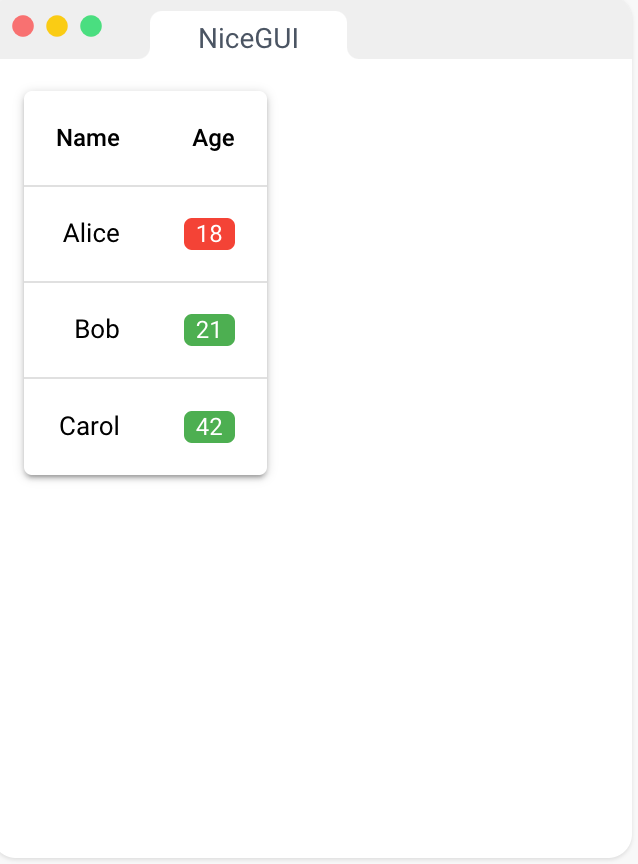
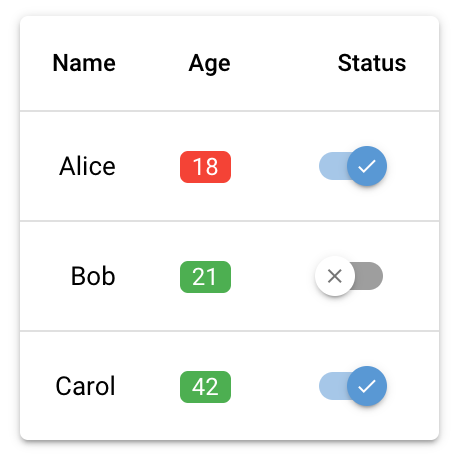
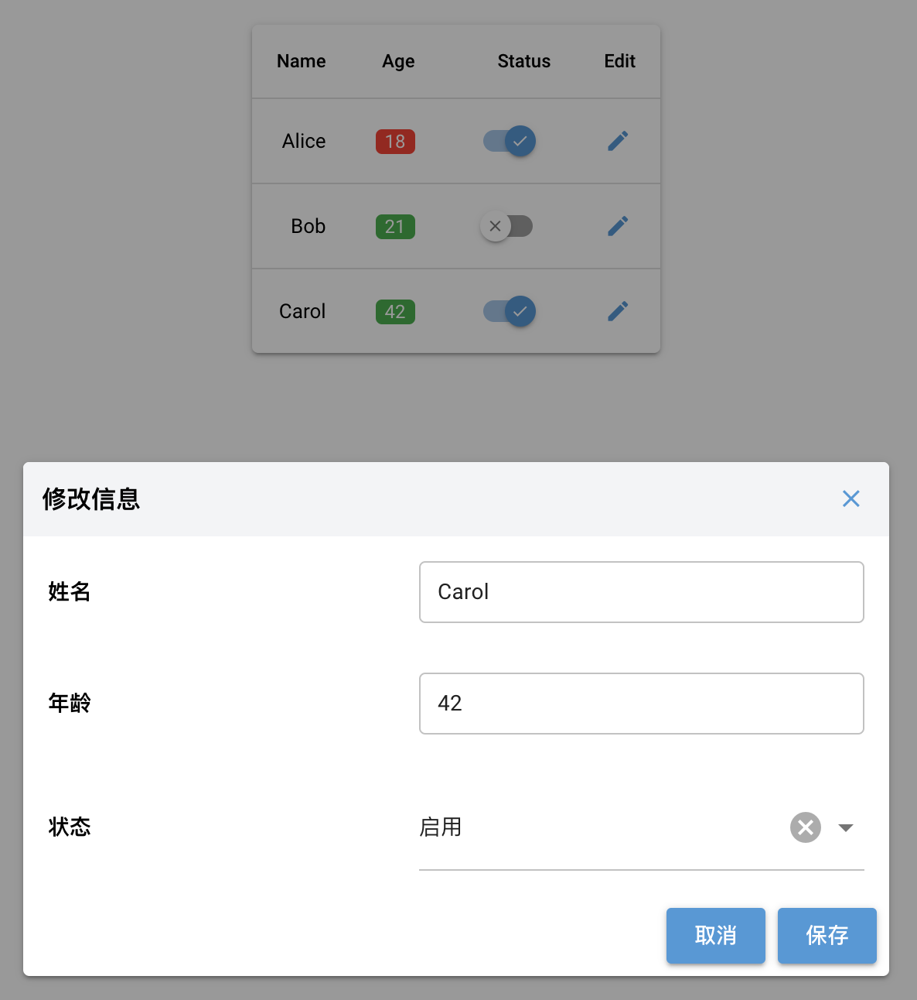

# ui.tables 案例

NiceGUI 中 `ui.table` 组件为我们提供了非常好的数据展示形式，但实际中我们可能对于数据展示有更多的展示需求，下面我们就扩展一下 `ui.table` 的使用。

## 1. 使用 UI 组件渲染单元格

### 1.1 使用 ui.badge 渲染

在渲染一些表格数据时，为了提高页面美化效果，我们常常希望将某些列渲染成更突出的元素。NiceGUI 官方提供了一个[示例](https://nicegui.io/documentation/table#conditional_formatting)，使用 `ui.badge` 组件渲染 `age` 字段，并根据字段值在颜色上做不同的突出。

{ width="300"}

```python linenums="1" hl_lines="12-18" title="条件格式化"
from nicegui import ui

columns = [
    {'name': 'name', 'label': 'Name', 'field': 'name'},
    {'name': 'age', 'label': 'Age', 'field': 'age'},
]
rows = [
    {'name': 'Alice', 'age': 18, 'status': True},
    {'name': 'Bob', 'age': 21, 'status': False},
]
table = ui.table(columns=columns, rows=rows, row_key='name')
table.add_slot('body-cell-age', '''
    <q-td key="age" :props="props">
        <q-badge :color="props.value < 21 ? 'red' : 'green'">
            {{ props.value }}
        </q-badge>
    </q-td>
''')
ui.run()
```

### 1.2 使用 switch 渲染

参照此方法，我们尝试下将 `status` 字段通过 `ui.switch` 组件渲染，更突出用户的活跃状态。

```python linenums="1" hl_lines="21-29" title="ui.switch组件渲染status字段"
from nicegui import ui

columns = [
    {'name': 'name', 'label': 'Name', 'field': 'name'},
    {'name': 'age', 'label': 'Age', 'field': 'age'},
    {'name': 'status', 'label': 'Status', 'field': 'status'},
]
rows = [
    {'name': 'Alice', 'age': 18, 'status': True},
    {'name': 'Bob', 'age': 21, 'status': False},
    {'name': 'Carol', 'age': 42, 'status': True},
]
table = ui.table(columns=columns, rows=rows, row_key='name')
table.add_slot('body-cell-age', '''
    <q-td key="age" :props="props">
        <q-badge :color="props.value < 21 ? 'red' : 'green'">
            {{ props.value }}
        </q-badge>
    </q-td>
''')
table.add_slot('body-cell-status', '''
    <q-td key="status" :props="props">
        <q-switch 
            v-model="props.value"
            checked-icon="check" 
            unchecked-icon="clear"
        />
    </q-td>
''')
ui.run()
```

{ width="300"}

我们发现表格确实正常渲染了，但是这种方式下 `ui.switch` 组件却 **无法点击切换状态**，我们需要使用 `v-model="props.row.status"` 来绑定到每行 `status` 的值，就可以正常切换状态了。

```python linenums="1" hl_lines="4" title="ui.switch组件渲染status字段"
table.add_slot('body-cell-status', '''
    <q-td key="status" :props="props">
        <q-switch 
            v-model="props.row.status"
            checked-icon="check" 
            unchecked-icon="clear"
        />
    </q-td>
    ''')
```

???+ example "switch组件切换状态后，同步 `status` 更新至数据库"

    如果我们想要功能更便捷，那么可以切换状态后，立马将更改同步至数据中，这里参考 NiceGUI 官方的表格下拉[示例](https://nicegui.io/documentation/table#table_with_drop_down_selection)，稍作改动来实现此功能。

    ```python linenums="1" hl_lines="5-8 16"
    from nicegui import events, ui

    def sync_status(e: events.GenericEventArguments):
        for row in table.rows:
            if row['id'] == e.args['id'] and row['status'] != e.args['status']:
                # 将此条数据会更新到数据库
                user_db_table.update(row)
                row['status'] = e.args['status']
        
        ui.notify(f'Table.rows is now: {table.rows}')

    columns = [
        {'name': 'name', 'label': 'Name', 'field': 'name'},
        {'name': 'age', 'label': 'Age', 'field': 'age'},
        {'name': 'status', 'label': 'Status', 'field': 'status'},
    ]
    rows = [
        {'id': 1, 'name': 'Alice', 'age': 18, 'status': True},
        {'id': 2, 'name': 'Bob', 'age': 21, 'status': False},
        {'id': 3, 'name': 'Carol', 'age': 42, 'status': True},
    ]

    table = ui.table(columns=columns, rows=rows, row_key='name')
    table.add_slot('body-cell-age', '''
        <q-td key="age" :props="props">
            <q-badge :color="props.value < 21 ? 'red' : 'green'">
                {{ props.value }}
            </q-badge>
        </q-td>
    ''')

    table.add_slot('body-cell-status', '''
        <q-td key="status" :props="props">
            <q-toggle v-model="props.row.status" 
                checked-icon="check" unchecked-icon="clear" 
                @update:model-value="() => $parent.$emit('sync_status', props.row)"
            />
        </q-td>
        ''')
    table.on('sync_status', sync_status)
    ui.run()
    ```

### 1.3 编辑按钮



在很多用户列表页上，表格最后一列有编辑按钮，点击后可以出现弹窗来更新相关数据。

```python linenums="1"
columns.append(
    {'name': 'edit', 'label': '编辑', 'field': '', 'align': 'left'}
)

...

table.add_slot('body-cell-status', '''
    <q-td key="status" :props="props">
        <q-toggle v-model="props.row.status"
            checked-icon="check" unchecked-icon="clear"
            @update:model-value="(e) => $parent.$emit('sync_status', props.row)"
        />
    </q-td>
''')

table.add_slot('body-cell-edit', '''
    <q-td key="edit" :props="props">
        <q-btn icon="edit" flat dense color="primary" size="sm"/>
    </q-td>
    ''')
```

### 1.4 根据列名进行条件渲染

一种情况是，我们需要 `add_slot` 中遍历所有列，并且需要判断当列名在不同条件下，使用不同组件进行渲染。

```python linenums="1"
table.add_slot('body', '''
    <q-tr :props="props">
        <q-td v-for="col in props.cols" :key="col.name" :props="props">
            <template v-if="col.name === 'status'">
                <q-toggle v-model="props.row.status"
                    checked-icon="check" unchecked-icon="clear"
                    @update:model-value="(e) => $parent.$emit('sync_status', props.row)"
                />
            </template>
            <template v-else>
                {{ col.value }}
            </template>
        </q-td>
        <q-td auto-width>
            <q-btn size="sm" color="accent" round dense flat
                icon="edit" />
        </q-td>
    </q-tr>
''')
```

!!! warning "建议"

    这种方法问题在于 `table` 开启的选择框会被覆盖掉，导致字段值错位，需要我们重新定义多选框，处理上比较麻烦。建议采用 `table.add_slot('body-cell-[name]', ...)` 方式来渲染。

## 2. 添加搜索框

## 3. 添加数据

## 4. 删除数据

## 5. 冻结窗口

